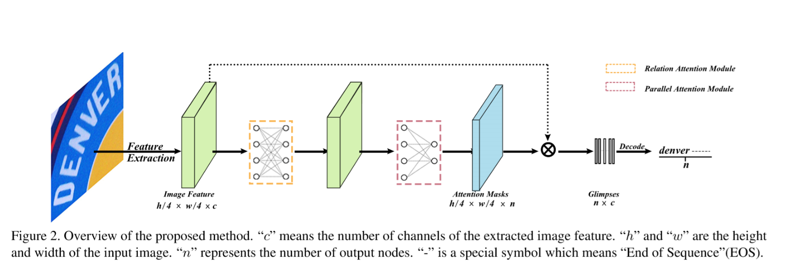

# 2D Attentional Irregular Scene Text Recognizer

## Requirements
* mxnet 1.4
* opencv3
* mxboard

## Data Preparation
train: prepare a text in the following format, use '\t' as a separator
/path/to/img.jpg label
...

## Train
1. config the `train_data_path`,`val_data_path`in ./configs/eng_config.py or chr_config.py
2. use following script to train
 python3 train.py

## Predict 
1. modify test_demo.py 
2. use following script to predict
 python3 test_demo.py

